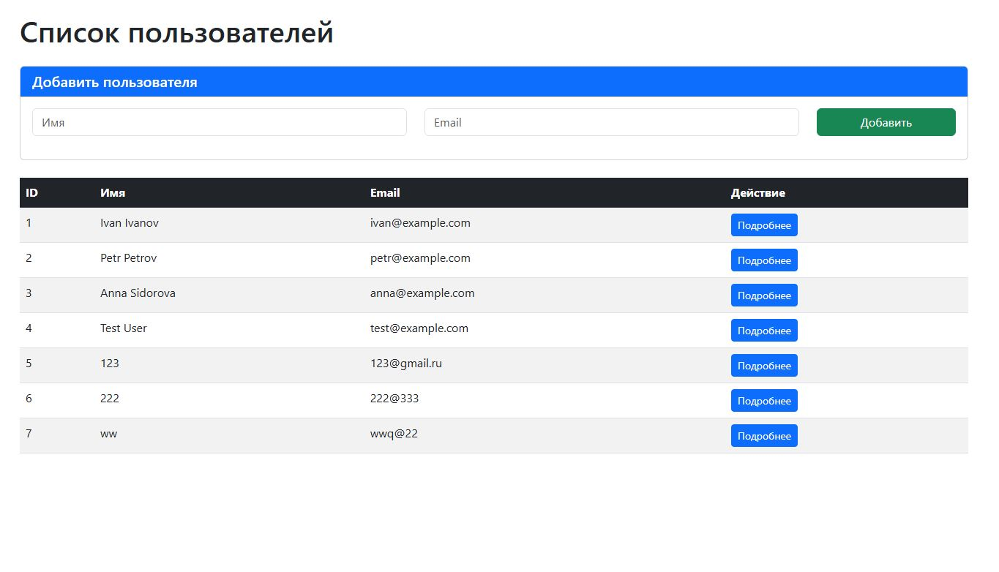
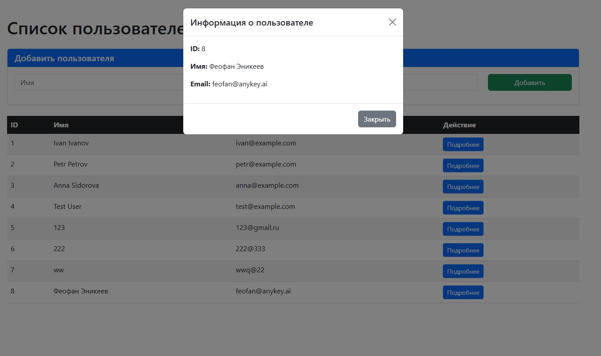
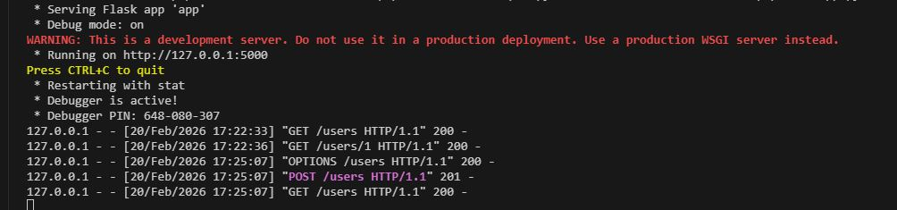

# Веб-приложение "Пользователи"

Простое веб-приложение для управления списком пользователей с использованием Flask (бэкенд) и vanilla JavaScript (фронтенд).

## Возможности

- Просмотр списка всех пользователей
- Добавление новых пользователей
- Просмотр детальной информации о пользователе в модальном окне
- Асинхронное обновление данных без перезагрузки страницы

## Технологии

- **Бэкенд:** Python, Flask, SQLite
- **Фронтенд:** HTML, CSS (Bootstrap 5), JavaScript (Fetch API)
- **База данных:** SQLite

## Требования

- Python 3.8+
- pip

## Установка

1. Клонируйте репозиторий:
```bash
git clone <repository-url>
cd pobeda
```

2. Создайте виртуальное окружение (опционально):
```bash
python -m venv .venv
```

3. Активируйте виртуальное окружение:
- Windows: `.venv\Scripts\activate`
- Linux/Mac: `source .venv/bin/activate`

4. Установите зависимости:
```bash
pip install -r requirements.txt
```

## Запуск

```bash
python app.py
```

Приложение будет доступно по адресу: http://127.0.0.1:5000/

## API Endpoints

| Метод | URL | Описание |
|-------|-----|----------|
| GET | `/users` | Получить список всех пользователей |
| GET | `/users/<id>` | Получить пользователя по ID |
| POST | `/users` | Создать нового пользователя |

### Примеры использования API

**Получить всех пользователей:**
```bash
curl http://127.0.0.1:5000/users
```

**Получить пользователя по ID:**
```bash
curl http://127.0.0.1:5000/users/1
```

**Добавить пользователя:**
```bash
curl -X POST http://127.0.0.1:5000/users \
  -H "Content-Type: application/json" \
  -d '{"name": "Иван Иванов", "email": "ivan@example.com"}'
```

## Структура проекта

```
pobeda/
├── app.py          # Flask приложение (бэкенд)
├── index.html      # HTML страница (фронтенд)
├── requirements.txt # Зависимости Python
├── .gitignore     # Git игнорируемые файлы
└── users.db       # База данных SQLite (создаётся автоматически)
```

## База данных

При первом запуске автоматически создаётся таблица `users` с тестовыми данными:
- Иван Иванов (ivan@example.com)
- Петр Петров (petr@example.com)
- Анна Сидорова (anna@example.com)

## Скриншоты


## Скриншоты







---

## Лицензия

MIT
